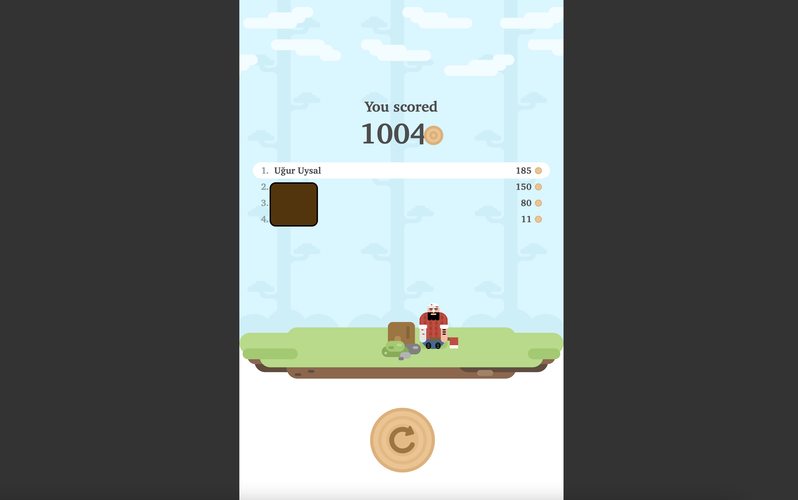

This is a game bot written for *Lumberjack* game at *Telegram* platform. It's developed by using python, image processing(*OpenCV* and *NumPy*), and GUI interaction libraries(several libraries are used). I enjoyed coding this bot and I wanted to share the code.

I hope you enjoy that bot, you may use it to get the highest score against your friends or you can challenge yourself and improve the performance, and score more than 1010(the highest score I get).


## Story Time
First I used *PyAutoGui* library for UI and keyboard interaction but unfortunately, it was slow. Taking a screenshot of a given region and hitting a key took more than 100 milliseconds,  and the bot was not able to score more than 150 pts. But after changing keyboard interaction and screenshot libraries, it was enough to make more than 900 points. After some adjustments, I was able to get 1000 points.

## Design
The bot is designed to solve the game through UI interactions (image processing and keyboard interaction). The first part was detecting correct moves using image processing, edge detection then applying template matching on grayscale images. Calculating the next moves is straightforward after the template matching. If the tree is on the right side then press the left button twice and vice versa.

## How to Use
I coded this code for macOS. After several modifications, it can be run on other operating systems.
* You must be using macOS and Telegram Desktop Client is installed
* Fetch the repository
* Install the dependencies, if you are using conda environment manager for python you can check requriments.txt
* Launch the *Telegram Desktop* and start the game with your friend
* Run the ```python main.py``` command to terminal and watch the bot in action





[](http://www.youtube.com/watch?v=PW-yBRepZ_8)
